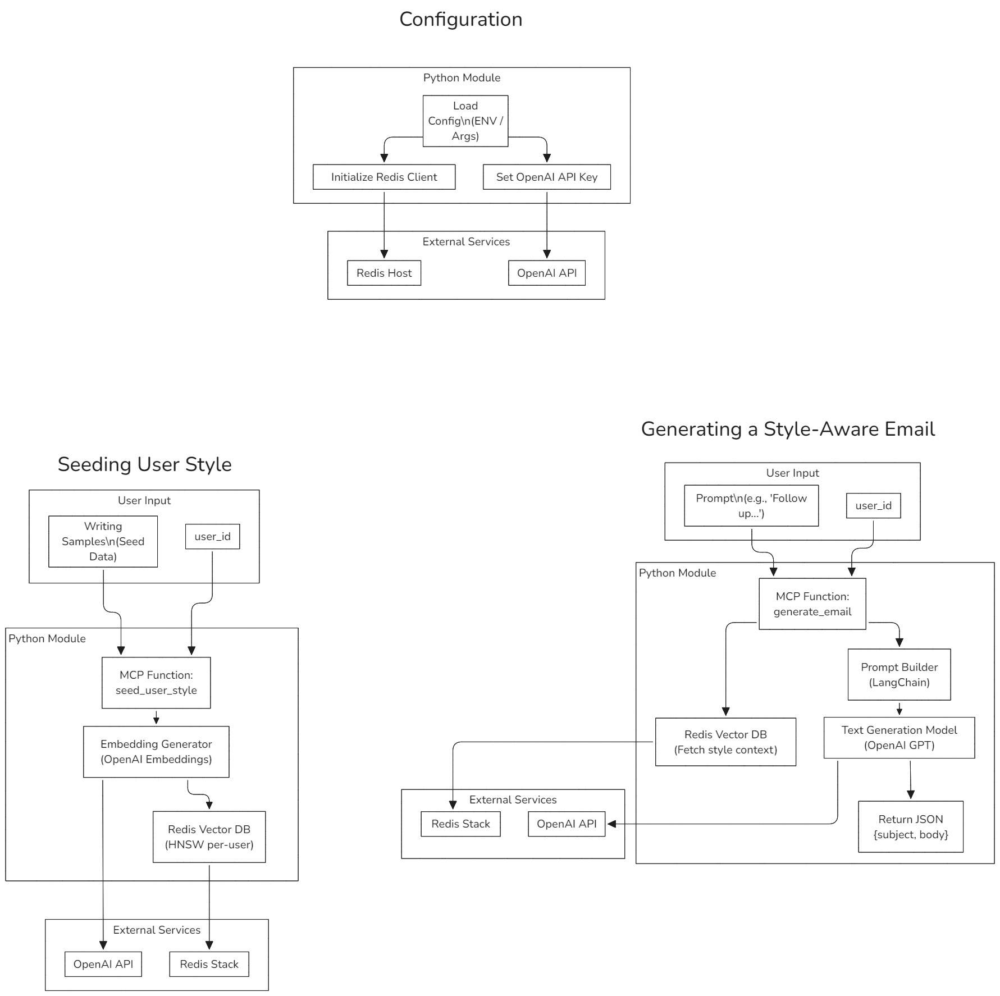

# Project Overview

This repository contains a Proof of Concept (POC) for generating personalized, style-aware emails using OpenAI and Redis. It includes a Python module, CLI, and Node.js wrapper, along with a FastAPI server for handling requests.

## Features

- Retrieval-Augmented Generation (RAG)
- Multi-user style memory via Redis
- Stateless, embeddable design
- CLI and Node.js wrapper
- Configurable via environment variables or arguments

## Installation

1. Clone the repository:
   ```bash
   git clone <repository-url>
   cd <repository-directory>
   ```

2. Install Python dependencies:
   ```bash
   pip install -r stylemail/requirements.txt
   ```

3. Set up environment variables:
   - `OPENAI_API_KEY`
   - `REDIS_URL` (default: `redis://localhost:6379`)

## Usage

### Python

```python
from stylemail import seed_user_style, generate_email

seed_user_style("user123", ["Thanks for your message.", "Looking forward to our meeting."])
email = generate_email("user123", "Follow up on the proposal")
print(email["body"])
```

### CLI

```bash
python -m stylemail.cli seed user123 "Sample 1" "Sample 2"
python -m stylemail.cli generate user123 "Follow up on the proposal"
```

### Node.js

```js
const { seedUserStyle, generateEmail } = require("./stylemail/js/stylemail");

seedUserStyle("user123", ["Thanks!", "See you soon."], console.log);
generateEmail("user123", "Follow up on the proposal", console.log);
```

## FastAPI Server

Run the server using:
```bash
uvicorn server:app --reload
```

### API Endpoints

- **POST /seed**: Seed user style with writing samples.
- **POST /generate**: Generate a style-aware email.
- **POST /fetch-nudge-data**: Fetch nudge data for an employee.
- **POST /nudge-email**: Generate an email based on nudges.
- **POST /nudge-summary**: Generate a summary for nudges.

## Diagram



## Testing

Run tests using:
```bash
pytest stylemail/tests
```

## Conclusion

This POC demonstrates the integration of OpenAI's API with Redis to create a flexible and scalable system for generating personalized emails. The architecture supports both synchronous and asynchronous operations, making it suitable for various deployment scenarios.
