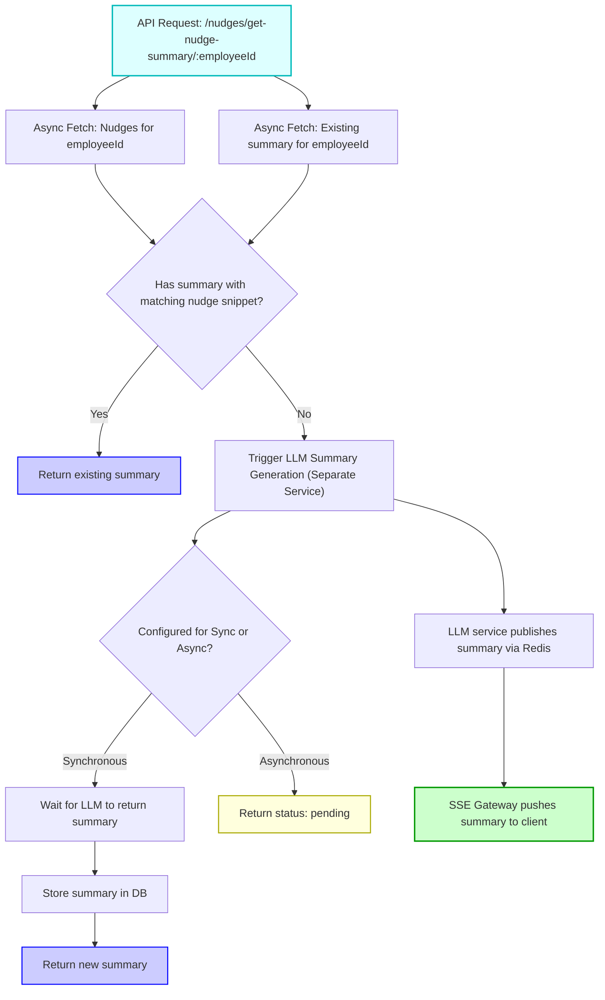

# Nudge Summary Creation Flow

## POC Overview

The POC demonstrates generating a nudge summary for a given employee by processing their nudge data and producing a concise output using the OpenAI API. This includes fetching data, preparing it, generating a summary, and storing/retrieving it as needed.

### POC Flow of Operations

1. **Data Retrieval**

   - Nudge data is fetched via a standalone **Nudges API**, using `employeeId`.

2. **Nudge Data Preparation**

   - Nudges are formatted to extract:
     - `title`
     - `instructions`
     - `metrics`
   - A `nudge snippet` is generated from the titles to uniquely represent the current nudge set.

3. **Summary Check & Generation**

   - If a summary already exists for the same employee and `nudge snippet`, it is reused.
   - Otherwise, a new summary is generated via the `generate_nudge_summary` function using OpenAI.

4. **Storage**

   - Summaries are saved in the **client database** with relevant metadata.

5. **Response**

   - The API returns the existing or newly generated summary.

---

## Database Schema

The `employee_nudge_summary` table is used to store summaries of nudges for employees. It has a foreign key relationship with the `employee` table, which stores employee details.

### Table: employee_nudge_summary

| Column Name   | Data Type   | Description                          |
|---------------|-------------|--------------------------------------|
| employee_id   | INT         | Primary key, foreign key to `employee.id` |
| created_date  | DATETIME    | Timestamp when the summary was created |
| summary       | TEXT        | The generated summary for the employee |
| nudge_snippet | TEXT        | A unique representation of the current nudge set |

### Table: employee

| Column Name | Data Type | Description          |
|-------------|-----------|----------------------|
| id          | INT       | Primary key          |
| name        | TEXT      | Name of the employee |
| department  | TEXT      | Department of the employee |

The `employee_id` in the `employee_nudge_summary` table references the `id` column in the `employee` table, establishing a foreign key relationship.

## Findings & Final Implementation

The final production version will change key parts of the architecture and flow while retaining the core logic. Below is a comparison:

### Architectural Changes

| Aspect             | POC                              | Final Implementation                         |
| ------------------ | -------------------------------- | -------------------------------------------- |
| **Service**        | Standalone prototype             | Integrated into `property-aggregator`        |
| **Endpoint**       | External API for nudges and auth | `GET /nudges/get-nudge-summary/:employeeId`  |
| **Authentication** | Handled via explicit Auth API    | Managed by middleware (transparent to logic) |
| **Database**       | Client DB (for summary storage)  | Same client DB (structure remains unchanged) |

---

### Workflow Improvements

| Step                   | POC                                | Final Implementation                                  |
| ---------------------- | ---------------------------------- | ----------------------------------------------------- |
| **Nudge Query**        | Called synchronously               | Queried asynchronously using JS (e.g., `async/await`) |
| **Summary Query**      | Called synchronously               | Queried asynchronously                                |
| **Change Detection**   | Manual check using `nudge snippet` | Same, but done within async workflow                  |
| **Summary Generation** | Always triggered if snippet is new | Only triggered if nudges have changed                 |
| **Storage**            | Writes summary regardless          | Writes summary only if updated                        |
| **Response**           | Returns summary                    | Same, but with more efficient pre-checks              |

---

### Summary Update Logic

- A `nudge snippet` (concatenation of nudge titles) is used to detect if nudges have changed.
- If the current snippet doesn’t match the stored one for an employee:
  - A new summary is generated using OpenAI.
  - The summary is saved with the new snippet.
- If it matches the stored snippet:
  - The stored summary is reused — no regeneration needed.

---

### LLM Summary Processing & Delivery Strategy

In the final implementation, LLM summary generation will be handled by a **separate service or process**. The `/nudges/get-nudge-summary/:employeeId` endpoint will support two modes of operation:

#### 1. **Synchronous Mode (Optional)**

- The API call waits until the LLM service returns the summary.
- Useful for internal tools or where low latency is acceptable.
- The response includes the summary directly.

#### 2. **Asynchronous Mode with SSE (Recommended)**

- The endpoint triggers LLM summary generation in the background.
- It immediately returns:

```json
{
  "status": "pending",
  "employeeId": "123",
  "summaryAvailable": false
}
```

- The LLM generation is handled via a pub/sub model within a microservice architecture.
- When complete, the summary is pushed to the client using **Server-Sent Events (SSE)**.

---

## Nudge Summary Flowchart


