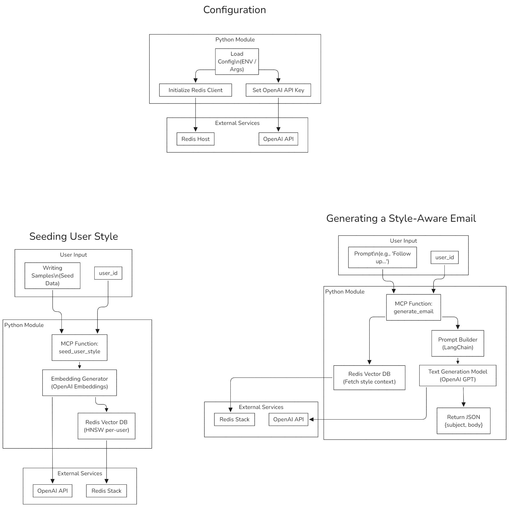

# StyleMail POC

A pluggable Python module for generating personalized, style-aware emails using OpenAI and Redis.

## Overview

This Proof of Concept (POC) demonstrates the ability to generate personalized emails by seeding user writing styles and using OpenAI's API for text generation. The system leverages Redis for storing user-specific style embeddings.

## Features

- ✅ Retrieval-Augmented Generation (RAG)
- ✅ Multi-user style memory via Redis
- ✅ Stateless, embeddable design
- ✅ CLI and Node.js wrapper
- ✅ Configurable via environment variables or arguments

## Installation

```bash
pip install -r requirements.txt
```

## Usage

### Python

```python
from stylemail import seed_user_style, generate_email

seed_user_style("user123", ["Thanks for your message.", "Looking forward to our meeting."])
email = generate_email("user123", "Follow up on the proposal")
print(email["body"])
```

### CLI

```bash
python -m stylemail.cli seed user123 "Sample 1" "Sample 2"
python -m stylemail.cli generate user123 "Follow up on the proposal"
```

### Node.js

```js
const { seedUserStyle, generateEmail } = require("./js/stylemail");

seedUserStyle("user123", ["Thanks!", "See you soon."], console.log);
generateEmail("user123", "Follow up on the proposal", console.log);
```

## Configuration

Set via environment variables:

- `OPENAI_API_KEY`
- `REDIS_URL` (default: `redis://localhost:6379`)

## POC Flow

### Configuration

- Load configuration from environment variables or arguments.
- Initialize Redis client and set OpenAI API key.

### Seeding User Style

- Input: Writing samples and user ID.
- Process: Generate embeddings using OpenAI and store them in Redis.

### Generating a Style-Aware Email

- Input: Prompt and user ID.
- Process: Retrieve style context from Redis, build a prompt, and generate an email using OpenAI.

## Diagram



This diagram illustrates the flow of operations for configuration, seeding user style, and generating a style-aware email.

## Conclusion

This POC showcases the integration of OpenAI's API with Redis to create a flexible and scalable system for generating personalized emails. The architecture supports both synchronous and asynchronous operations, making it suitable for various deployment scenarios.
